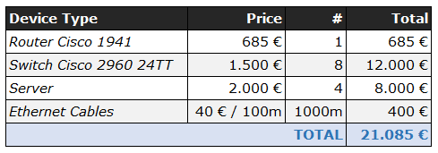
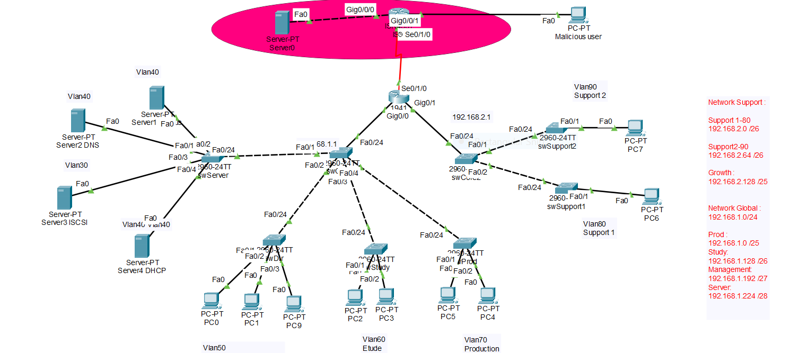
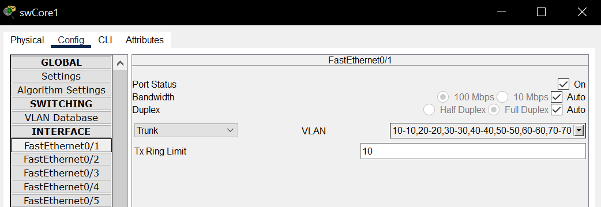
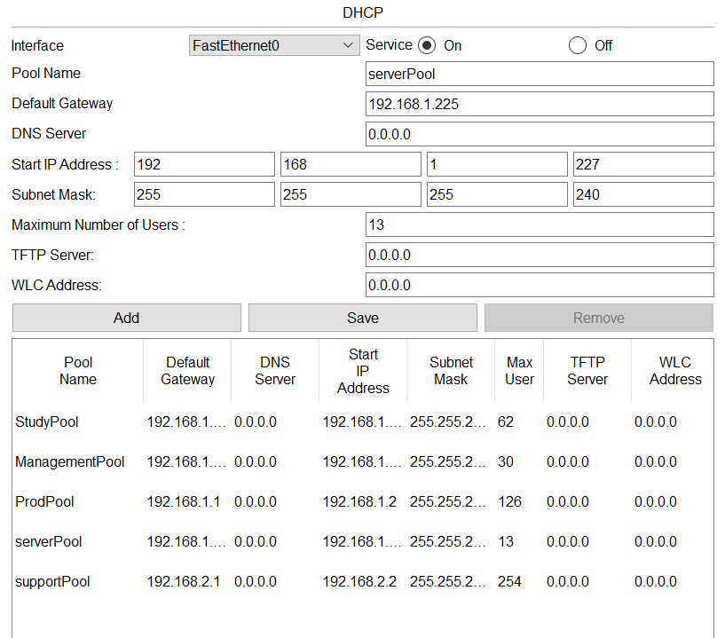
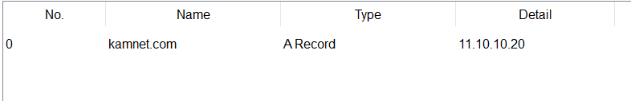
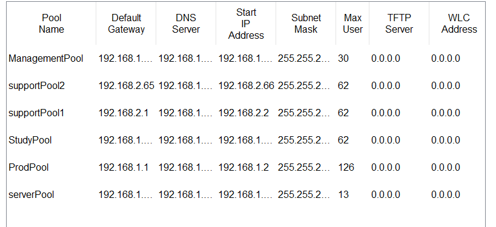
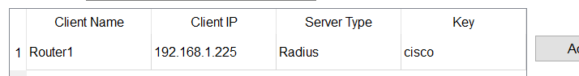
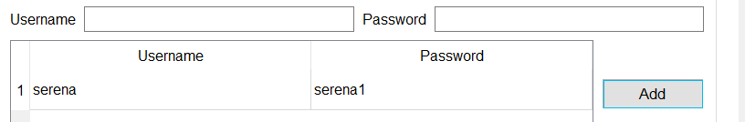

# TABLE OF CONTENTS

1. PROJECT OVERVIEW  
2. NETWORK DEFINITION  
	a. Current setup  
	b. Network/Subnet Attribution  
	c. VLAN segmentation  
	d. Network Topology  
	e. Network setup  
	f. Costs  
3. DEPLOYMENT  
	a. VLAN Configuration  
	b. DHCP Server configuration  
	c. Configuration DNS Server  
	d. Configuration Radius  
	e Storage - ISCSI Server  
	f. Using PAT on the Network Router  

# 1. PROJECT OVERVIEW

**Project Context:**


KamNet is a production company relocating to a new office. The company needs a new secure and efficient network. The goal is to modernize the actual setup with a cost-effective, well-structured plan that optimizes resource allocation while adhering to stringent security best practices.

**Constraints and Requirements:**

* **Client Requirements:**

    * DNS server
    * DHCP server
    * DMZ concept implemented through VLANs and access control lists (ACLs) (firewall alternative)
    * iSCSI storage server
    * Four network sectors:
        * Management/Secretariat (5 workstations)
        * Study (8 workstations)
        * Production (10 workstations)
        * Support (2 sectors, 10 workstations each) 
    - Extensive security managed through firewall or alternative

**Guidelines:**

* **Scalability and Manageability:** Design a network that can accommodate future growth without compromising efficiency.
* **Resource Optimization:** Allocate resources strategically, considering costs and future needs.
* **Clear Documentation:** Document IP addressing, VLANs (if used), and device configurations meticulously.
* **Robust Security:** Implement measures like ACLs, strong passwords, and encryption (where applicable).
* **Cost-Effectiveness:** Make budget-conscious choices in equipment selection and configuration.

# 2. NETWORK DEFINITION

### a. Current setup

The current infrastructure of KamNet is composed of 43 end users dispatched in 5 sectors. The infrastructure also hosts 3 servers. 

The network is divided like so : 

Four network sectors:
    - Management/Secretariat (5 workstations)
    - Study (8 workstations)
    - Production (10 workstations)
    - Support (2 sectors, 10 workstations each)

The total of hosts is 46.

### b. Network / Subnet attributions

We decided to build the new infrastructure with 2 networks of 254 hosts each. The goal is to permit a reasonable growth of the company (from 46 to 512 hosts if required) while maintaining low costs and avoiding network congestion.

Each department is set on its own subnet, composed allowing its own possible growth based on the current setup. 

The figure below describes the possible growth of each department. 

| Name       | IP /CIDR                            | Current needs | Max Hosts | Potential growth |
| ---------- | ----------------------------------- | ------------- | --------- | ---------------- |
| Production | 192.168.1.0 /25                     | 10            | 126       | 1160%            |
| Study      | 192.168.1.128 /26                   | 8             | 62        | 675%             |
| Direction  | 192.168.1.192 /27                   | 5             | 30        | 500%             |
| Server     | 192.168.1.224 /28                   | 3             | 14        | 367%             |
| Support    | 192.168.2.0 /26<br>192.168.2.64 /26 | 20            | 124       | 520%             |
| Storage    | 192.168.1.240 /28                   | 1             | 14        | /                |
| ExtraPool2 | 192.168.2.128 /25                   | /             | 126       | /                |

It is noticeable that the Support department is set up on its own network. Likewise, if each subnet reach its hosts limits, it is still possible to use the 126 available hosts from ExtraPool2 in order to extend the Support department capacity.

### c. VLAN segmentation

To enhance inter-network security and reach manageability expectations, we decided to deploy a VLAN segmentation across the company network.

Each department is set on its own VLAN. This setup makes it easier to manage access to the different areas of the network. 
Since the end-user configuration is deployed through DHCP, adding extra computers to any department is almost Plug and Play.

The VLAN configuration is based on the Network/Subnet Definition

| Name       | VLAN<br>NUMBER | VLAN NAME | IP /CIDR          | Mask            | Gateway       |
| ---------- | -------------- | --------- | ----------------- | --------------- | ------------- |
| Server     | 40             | SERV      | 192.168.1.224 /28 | 255.255.255.240 | 192.168.1.225 |
| Direction  | 50             | MGMT      | 192.168.1.192 /27 | 255.255.255.224 | 192.168.1.193 |
| Study      | 60             | STUDY     | 192.168.1.128 /26 | 255.255.255.192 | 192.168.1.129 |
| Production | 70             | PROD      | 192.168.1.0 /25   | 255.255.255.128 | 192.168.1.1   |
| Support1   | 80             | SPT1      | 192.168.2.0 /26   | 255.255.255.192 | 192.168.2.1   |
| Support2   | 90             | SPT2      | 192.168.2.64 /26  | 255.255.255.192 | 192.168.2.65  |
| Storage    | 30             | ISCSI     | 192.168.1.240 /28 | 255.255.255.240 | 192.168.1.241 |
| ExtraPool1 |                | EXP2      | 192.168.2.128 /25 | 255.255.255.128 | 192.168.2.129 |

### d. Network Topology

The network is build regarding a mixed Star and Tree topology.

Each of 192.168.1.0 network 192.168.2.0 network is build around a central Switch, corresponding to a Star topology ensuring a cost effective and scalable infrastructure at a company level.

Both top switch from those networks are linked to a top router (Tree topology) for manageability purpose. 

Within each department/subnetwork, the hosts are linked to their own switch in order to ensure a fast and easy growth at a department level. 


### e. Network setup

Every piece of hardware is a Cisco product.

| Role          | Hardware    | Name        | Desc                                          |
| ------------- | ----------- | ----------- | --------------------------------------------- |
| Main Router   | 1941 Switch | Router1<br> | Handle traffic inside and outside the network |
| Core Switch   | 2960 Switch | swCore1     | Central hub. Manage VLANs authorization       |
| VLAN40 Switch | 2960 Switch | swServer    | Switch for the server                         |
| VLAN50 Switch | 2960 Switch | swDir       | Switch for Management                         |
| VLAN60 Switch | 2960 Switch | swStudy     | Switch for Study Department                   |
| VLAN70 Switch | 2960 Switch | swProd      | Switch for Production Department              |
| VLAN80 Switch | 2960 Switch | swSupport1  | Switch for Support1 Department                |
| VLAN90 Switch | 2960 Switch | swSupport2  | Switch for Support2 Department                |

### f. Costs



# 3. DEPLOYMENT



## a. VLAN Configuration 

Why put vlans in our project ? 

A **VLAN** (Virtual Local Area Network) allows you to segment a physical network into smaller, logical networks. Here's why they're useful: 

1. **Security**: Devices in different VLANs are isolated, reducing unauthorized access and protecting sensitive data. 

2. **Network Management**: VLANs enable logical grouping of devices (e.g., by department) without changing physical connections, making reconfiguration easier. 

3. **Performance**: VLANs reduce broadcast traffic, improving network efficiency. 

4. **Scalability**: Networks can be easily expanded by adding VLANs without altering physical infrastructure. 

5. **Cost Efficiency**: Fewer devices and less cabling are required. 

6. **QoS**: Prioritize traffic for critical services (e.g., voice, video). 

7. **Troubleshooting**: Issues are easier to isolate within specific VLANs. 

In short, VLANs improve security, performance, and manageability while providing flexibility in network design. 

#### Switch instructions for VLAN

Vlan 30  
```
SwServer>Enable 
SwServer#Conf t 
SwServer(config)#Vlan 30  
SwServer(config)#Name ISCSI 
SwServer(config)#Exit 
```

Vlan 40  
``` 
SwServer(config)#Vlan 40  
SwServer(config)#Name DNS 
SwServer(config)#Exit 
```


Vlan 50  
``` 
SwServer(config)#Vlan 50  
SwServer(config)#Name MNGMT 
SwServer(config)#Exit 
```


Vlan 60  
``` 
SwServer(config)#Vlan 60  
SwServer(config)#Name STUDY 
SwServer(config)#Exit 
```


Vlan 70  
``` 
SwServer(config)#Vlan 70  
SwServer(config)#Name PROD 
SwServer(config)#Exit 
```


Vlan 80  
``` 
SwServer(config)#Vlan 80  
SwServer(config)#Name SPT1 
SwServer(config)#Exit 
```


Vlan 90  
``` 
SwServer(config)#Vlan 90  
SwServer(config)#Name SPT2 
SwServer(config)#Exit 
```

Configure the interfaces

```
SwServer(config)#Interface fastEthernet0/1 
SwServer(config-if)#switchport mode access  
SwServer(config-if)#switchport access vlan 40  
SwServer(config-if)#no shutdown 
SwServer(config-if)#exit 
```


```
SwServer(config)#Interface fastEthernet0/2 
SwServer(config-if)#switchport mode access  
SwServer(config-if)#switchport access vlan 40  
SwServer(config-if)#no shutdown 
SwServer(config-if)#exit 
```


```
SwServer(config)#Interface fastEthernet0/3 
SwServer(config-if)#switchport mode access  
SwServer(config-if)#switchport access vlan 30  
SwServer(config-if)#no shutdown 
SwServer(config-if)#exit 
```


```
SwServer(config)#Interface fastEthernet0/4 
SwServer(config-if)#switchport mode access  
SwServer(config-if)#switchport access vlan 40  
SwServer(config-if)#no shutdown 
SwServer(config-if)#exit 
```

Do the same on the other switchs (swDir, swStudy, swProd, swSupport1, swSupport2) 

On our principal switch we have to put the trunk mode and tell which vlan can communicate with which VLAN : 



## b. DHCP Server configuration

What is a DHCP Server?

A **DHCP server** (Dynamic Host Configuration Protocol server) automatically assigns IP addresses and other network configuration settings (like DNS, gateway, subnet mask) to devices (clients) on a network. This ensures that each device gets a unique IP address without manual configuration. 

### Key Functions: 

1. **Automatic IP Assignment**: When a device connects to a network, the DHCP server dynamically assigns it an IP address from a predefined range (or pool). 

2. **IP Address Management**: It prevents IP conflicts by ensuring no two devices get the same IP. 

3. **Efficient Network Configuration**: It simplifies network management, especially in large networks, by automating the assignment of IP addresses. 

4. **Lease Duration**: IP addresses are assigned temporarily (leased), and the DHCP server manages renewals or reassignments. 

#### Setting- up DHCP Server Configuration  

First we have to set the static ip address of the DHCP server : on the DHCP server on the pannel Dekstop -> Ip Configuration enter  

IPv4 address : 192.168.1.226 
Subnet mask : 255.255.255.240 
Default gateway : 192.168.1.225 

Then on the panel Services -> DHCP we have to create our pools : 



Now we have to configure the virtualisation of the interfaces of our router  : 

```
Router>Enable 
Router#Conf t  
Router(config)#Interface gigabiEthernet0/0.40
Router(config)#encapsulation dot1q 40
Router(config-subif)#Ip address 192.168.1.225 255.255.255.0 
Router(config-subif)#Ip helper-address 192.168.1.226 
Router(config-subif)#Exit 

Router(config)#Interface gigabiEthernet0/0.50 
Router(config)#encapsulation dot1q 50
Router(config-subif)#Ip address 192.168.1.193 255.255.255.0 
Router(config-subif)#Ip helper-address 192.168.1.226 
Router(config-subif)#Exit 

Router(config)#Interface gigabiEthernet0/0.60 
Router(config)#encapsulation dot1q 60
Router(config-subif)#Ip address 192.168.1.129 255.255.255.0 
Router(config-subif)#Ip helper-address 192.168.1.226 
Router(config-subif)#Exit

Router(config)#Interface gigabiEthernet0/0.70 
Router(config)#encapsulation dot1q 70
Router(config-subif)#Ip address 192.168.1.1 255.255.255.0 
Router(config-subif)#Ip helper-address 192.168.1.226 
Router(config-subif)#Exit

Router(config)#Interface gigabiEthernet0/0.80 
Router(config)#encapsulation dot1q 80
Router(config-subif)#Ip address 192.168.2.1 255.255.255.0 
Router(config-subif)#Ip helper-address 192.168.1.226 
Router(config-subif)#Exit

Router(config)#Interface gigabiEthernet0/0.90 
Router(config)#encapsulation dot1q 90
Router(config-subif)#Ip address 192.168.2.65 255.255.255.0 
Router(config-subif)#Ip helper-address 192.168.1.226 
Router(config-subif)#Exit

Router(config)#Interface gigabiEthernet0/0
Router(config-if)#No shutdown
```

## c. Configuration DNS Server : 

What is a DNS server : 

A **DNS server** (Domain Name System server) translates human-readable domain names (like `www.example.com`) into IP addresses (like `192.0.2.1`) that computers use to locate and communicate with each other over the internet. 

### Key Functions: 

1. **Domain-to-IP Translation**: It converts domain names into their corresponding IP addresses so users can access websites using easy-to-remember names instead of numbers. 

2. **Name Resolution**: When you type a website's URL into your browser, the DNS server resolves the name to the correct IP address, directing your request to the right server. 

3. **Caching**: DNS servers cache previously resolved queries to speed up future requests to the same domain. 

4. **Distributed System**: DNS is a distributed database, with many servers worldwide working together to resolve names efficiently. 

We need an internet connexion. For that we need a router and a serveur that emulated the internet connexion. We add a server connected to a router connected to our principal router. This server allow us to host our site kamnet.com. Now in our DNS server we have to configure a static Ipv4 address: 

IPv4 address : 192.168.1.227 
Subnet mask : 255.255.255.240 
Default gateway : 192.168.1.225 

Then in the pannel Service -> DNS we have to add an A record: 



Now in our DHCP server we need to add the IP address of our DNS server in our different pools.



## d. Configuration Radius : 

What is radius server : A **RADIUS server** (Remote Authentication Dial-In User Service) is a centralized system that handles authentication, authorization, and accounting (AAA) for users connecting to a network. It's commonly used in large networks for secure access control, especially for remote or wireless users. 

### Key Functions: 

1. **Authentication**: Verifies a user's identity (e.g., via username and password) before allowing access to the network. 

2. **Authorization**: Determines what level of access or network resources the user is allowed after successful authentication. 

3. **Accounting**: Tracks user activities (e.g., connection times, data usage) for monitoring and billing purposes. 

Why a radius server in our project : 

This ensures that no-one can connect to our router locally or remotely without a username and password. 

First we have to give an static Ipv4 address to our radius server : 

IPv4 address : 192.168.1.228 
Subnet mask : 255.255.255.240 
Default gateway : 192.168.1.225 

##### Now we have to configure the AAA Services :  

We need to write down our service :



Now we add a user :  



Then we have to configure our principal router Router1 : 
```
Router>Enable 
Router#Conf t 
Router(config)#Aaa new-model 
```

Add a login/password in case of the radius server is down 

```
Router(config)#Username backup secret backup  
Router(config)#Radius-server host 192.168.1.228 key cisco 
Router(config)#Aaa authentication login default group radius local 
Router(config)#Line vty 0 15 
Router(config)#Login authentication default
```

## e. Storage - ISCSI server

For the ISCSI server we decide to put an other vlan on the iscsi server.
The server is located in a DMZ. 
To emulate the specific firewall controlling the traffic to this server, we put the server into a dedicated VLAN than only the Production Departement can access.

## f. Using PAT on the Network Router

Goal : 
Create a PAT configuration to prevent private IP to leave the network and enhance security while reducing the capability to reach a network host with its IP address.

### *Procedure* 

#### 1. Configure ISP Router to deny any private IPs

Normally ISP shouldn't allow private ip connexion. To simulate this in Packet Tracer, we will create an ACL on the ISP router that will deny any packet coming from a host on the network 192.168.1.0

##### a. Create an ACL

```
`Router(config)# access-list 10 deny 192.168.1.0 0.0.0.255`
`Router(config)# access-list 10 permit any`
```

This command creates an access-list (ACL) numbered 10. 
We passed to this list the instructions to deny any packet from the network 192.168.1.0 for every host 0.0.0.255 (whitecard mask).
Then, "any" hosts is "permit" to go through the router.

```
Note on ACL syntax : 
The router will test the packet over each line of the ACL, one after the other. If the condition is filled, then the packet will be permitted or discarded. Thus, it is important to keep broad instructions for the last instruction to avoid wrong addressing. 
```

##### b. Apply it to the interface

```
Router(config)# interface GigabitEthernet0/0
Router(config-if)# ip access-group 10 out
Router(config-if)# exit
Router(config)# exit
```

The ACL is applied to the related router interface. 

#### 2. Configuring the PAT on the Network Router

In this section, we will configure a PAT on the Network Router to convert private IPs from the company network into a single public IP.

To do so, we will first create an ACL to specify which private IPs will be converted to public IPs.
Then we will specify to the router the pool of public IP we will use, and link this pool to the ACL created. This is called dynamic Network Address Translation (NAT). 
Finally, we will instruct the router to turn the NAT into a PAT (Port Address Translation) to use a combination of ports with a single IP. 

##### a. Create the network ACL on Router1

```
Router(config)#access-list 10 permit 192.168.1.0 0.0.0.255
```

This ACL allows an host of the network to reach the router.

##### b. Create a NAT IP pool on router 1

```
Router(config)# ip nat pool NATD1 10.10.10.21 10.10.10.255 netmask 255.255.255.0
```

This IP pool, called NATD1, will instruct the router that the IP range from 10.10.10.21 to 10.10.10.255 can be used to replace the network private IPs.

##### c. Mapping the ACL with the NAT IP Pool

```
Router(config)#ip nat inside source list 10 pool NATD1
```

This command links the created ACL with the NAT IP Pool. 

##### d. Applying the mapping to the interface

Each interface of the router need to be informed if it is inside or outside the network in order to route the NAT the proper way.

```
Router(config)#int gig0/0.40
Router(config-if)#ip nat inside
Router(config-if)#exit
```

In our case, as we are using sub-interfaces in the router, each of the sub-interfaces are flagged as "inside" the nat.

The same command will be applied to gig0/0.40, gig0/0.50,  gig0/0.60 and  gig0/0.70. 

The interface se0/1/0 should be flagged as "outside" the network, as it will route the packets on the outside network.

```
Router(config)#int se0/1/0
Router(config-if)#ip nat outside
Router(config-if)#exit
```

At this point, on each packet leaving the company network, the private ips are converted into public ips. 

##### e. Activate the overload mode (PAT) 

This command will enable the port address translation. After this, the ips of the private network will be turned into a single public ip and a port number. 

```
Router(config)#ip nat inside source list 10 pool NATD1 overload
```

The PAT configuration is now set.

# 4. FUTURE IMPROVEMENTS

- Redundancy : increase the strength of the traffic with a second router
- Implementing ACL on every switch to secure traffic more precisely
- Monitor the traffic to see if we created any point of congestion

