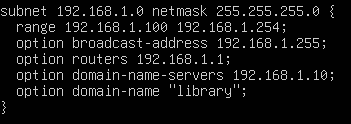
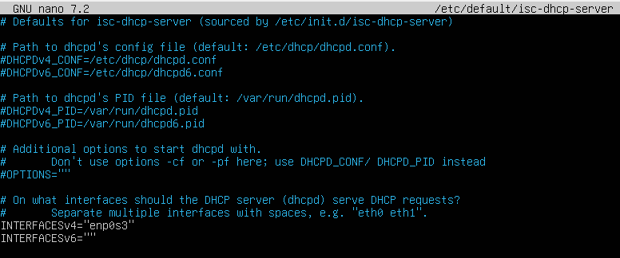
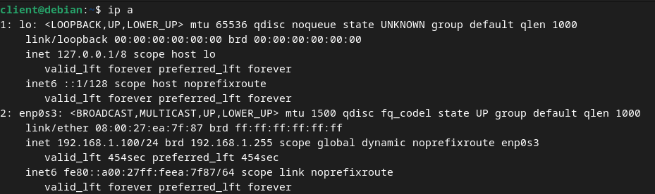

# DHCP Installation & Configuration Manual

We are going to be using a DHCP for the internal network.

## Installing DHCP on the Server

Make sure your system is up to date before starting. You can check with `sudo apt update`.

Once this is ok, run this command: `sudo apt install isc-dhcp-server`

## Configuring DHCP on the Server

Open the DHCP configuration file in a text editor. `sudo nano /etc/dhcp/dhcpd.conf`

Add a configuration for your local network at the end of the file. Adjust the subnet and options to fit your network.



Press CTRL + X then Y and Enter to save your changes.

Next, you need to specify which network interface the DHCP server will listen on. Open the DHCP server's default file. `sudo nano /etc/default/isc-dhcp-server`
Find the line that starts with INTERFACES and specify your network interface (enp0s3 in our case).


Now you can start the DHCP service and enable it to start at boot:
```sh
sudo systemctl start isc-dhcp-server
sudo systemctl enable isc-dhcp-server
```

To ensure that the DHCP server is running correctly, check its status. `sudo systemctl status isc-dhcp-server`
You should see an active status.


## Testing DHCP on the Client

Go to your client and run `ip a` to see if it received a correct address from your DHCP. As you can see, it's within our range.


We have a working DHCP !