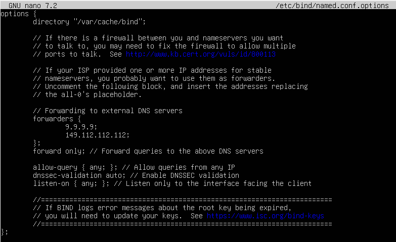
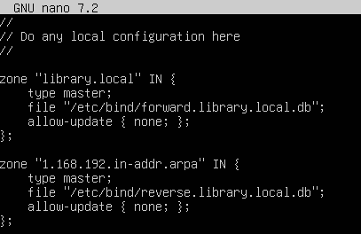
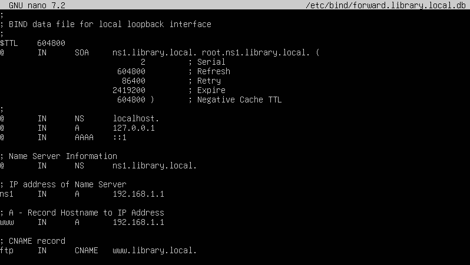
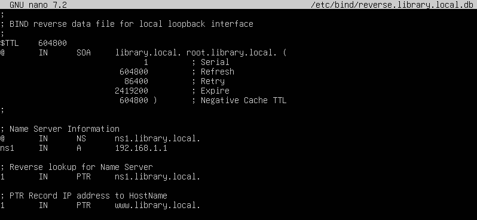
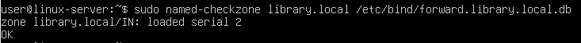
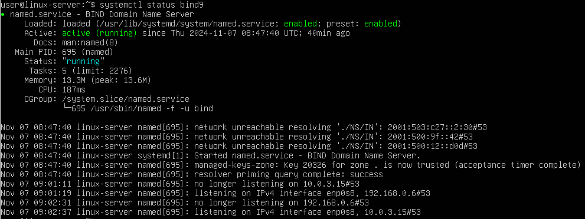
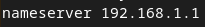
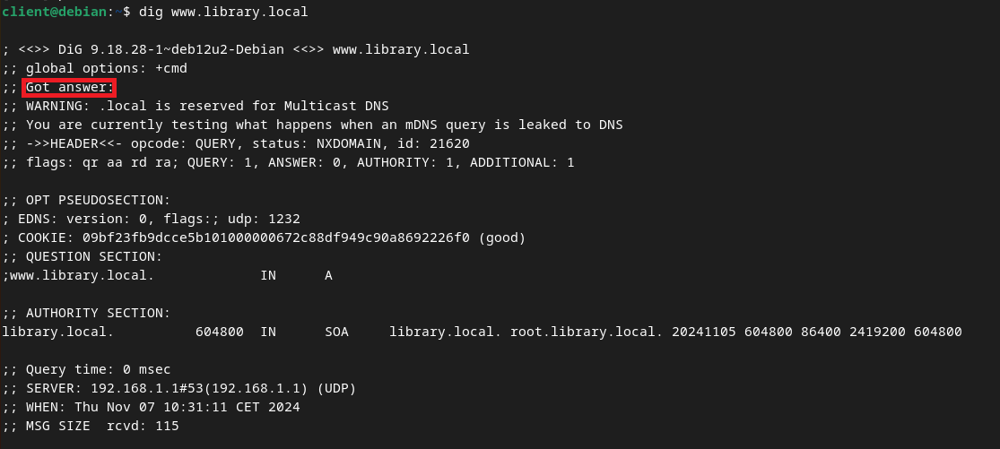

# DNS Installation & Configuration Manual

An important part of managing server configuration and infrastructure involves maintaining a way to find network interfaces and IP addresses by name. One way to do this is to set up a proper Domain Name System (DNS).
We will use the BIND name server software (BIND9) to resolve private hostnames and private IP addresses. This provides a central way to manage our internal hostnames and private IP addresses.

This DNS needs to resolve internal resources, while a redirector is used for external resources.

## Installing DNS on the Server

To install, run this command: `sudo apt install bind9`

## Configuring DNS on the Server

The main configuration file for BIND is located at "/etc/bind/named.conf" on Debian-based systems.
First, create a back-up of the default configuration with this command: `sudo cp /etc/bind/named.conf /etc/bind/named.conf.bak`

Then we will edit the configuration file like this. `sudo nano /etc/bind/named.conf.options`


Next we edit the _named.conf.local_ file and add these lines. This will define the zone for our internal resources.



Now we will copy the sample zone lookup file and create our new file. `sudo cp /etc/bind/db.local /etc/bind/forward.library.local.db`

Open this file to edit it like this:


Then we copy the sample reverse zone file. `sudo cp /etc/bind/db.127 /etc/bind/reverse.library.local.db`

Edit the contents of the file.



Time to check if the syntax of our created files is correct. Run `sudo named-checkzone library.local /etc/bind/forward.library.local.db` and `sudo named-checkzone 1.168.192.in-addr.arpa /etc/bind/reverse.library.local.db`. Both should give you the same output, otherwise edit the configuration.



Restart and enable the BIND DNS Server.
```
sudo systemctl restart bind9
sudo systemctl enable bind9
```

Check the status of the service.


Go to your client machine and add your new DNS Server IP address in "/etc/resolv.conf"



## Testing DNS on the Client

Use the "dig" command to verify the forward and reverse lookup. `dig www.library.local`


If you get an answer, you have successfully configured a DNS Server !