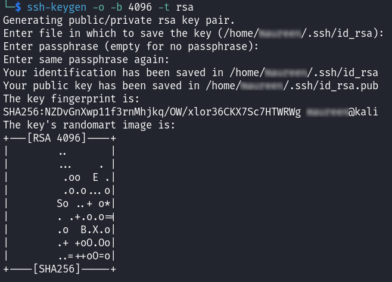

# SSH Installation & Configuration Manual

We will be using a secure shell (SSH) to access our server remotely. This was a requirement from the client.

## Installing SSH on the server

To fetch the installer run this command: `sudo apt install openssh-server`. Let it run until it's finished.

Next we start the SSH service. `sudo systemctl start ssh`

We're also enabling SSH to start automatically at boot. `sudo systemctl enable ssh`

## Configuring VM Network Settings

Go back to your VirtualBox Manager and edit the settings of your Linux Server. In the "Network" tab, change Adapter 1 to be attached to "Bridged Adapter" instead of "NAT".

Reboot your server with the "reboot" command.

## Accessing Server via SSH

To be able to access the server from another computer, you need to find its IP address first. Type `ip a` in your terminal and find the line starting with "inet" under an interface (likely "enp0s3"). This is the IP address you will use to connect to your server.


On the other computer, open a terminal or SSH client. Use this command, replacing `server_ip` with the actual IP address and `username` with your Linux Server username:
```sh
ssh username@server_ip
```

Example:


You will be asked if you're sure you want to continue connecting despite authenticity issues, type "yes". Then you have to enter your password.

And you should be connected !

## Securing with SSH Keys

On Unix systems you can generate your key pair with the following command: `ssh-keygen -o -b 4096 -t rsa`

In the following dialogue you will be required to answer two questions. Where to save the key pair? And which passphrase to use? Enter the answers of your choosing. A summary will be printed.


Next you need to copy the public key to the Linux Server. Use: `ssh-copy-id -i ~/.ssh/id_rsa.pub user@192.168.0.13` (with your own path and credentials).

The command wil run and you should be asked for your server password. Enter it, then attempt to log into the server like usual.

This time, you should be in without a password !
