# Linux Server Installation Manual

We are going to install an Ubuntu Server on a Virtual Machine. You can find download links for Ubuntu at [ubuntu.com](https://ubuntu.com/download/server) (always choose the LTS version). For the VMs this manual will be explained using [VirtualBox](https://www.virtualbox.org/) but you can use the software of your choice.

## Creating a Virtual Machine

First we will need to create a Virtual Machine to work on. Click the "New" button on top of VirtualBox.

A new window pops up where we have to enter a name for our Virtual Machine. Choose the folder where your VM will be installed. Then pick the correct folder where our .iso image is located. This should automatically fill-in the "Type" and "Version" fields. At the bottom there is a box you can check to skip unattended installation, as we will do it manually.
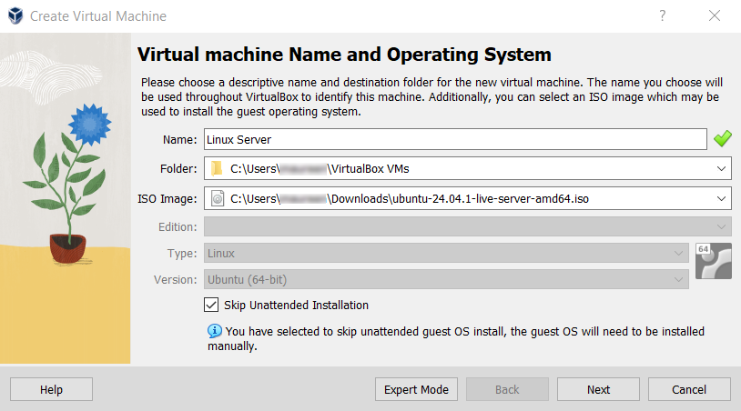

When you entered all the information, click "Next".

This next window is about hardware. Base Memory should be set at 2GB and Processors at 1 CPU.
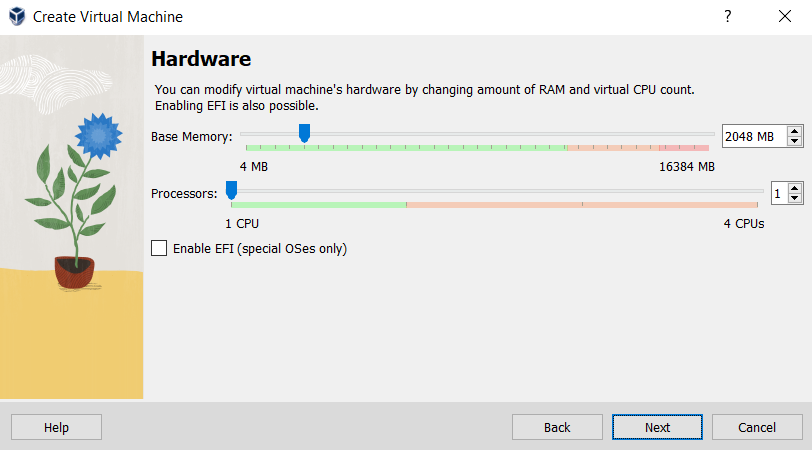

Next we have the Virtual Hard disk configuration. Choose the "Create a Virtual Hard Disk Now" option with minimum 5 GB as Disk Size.
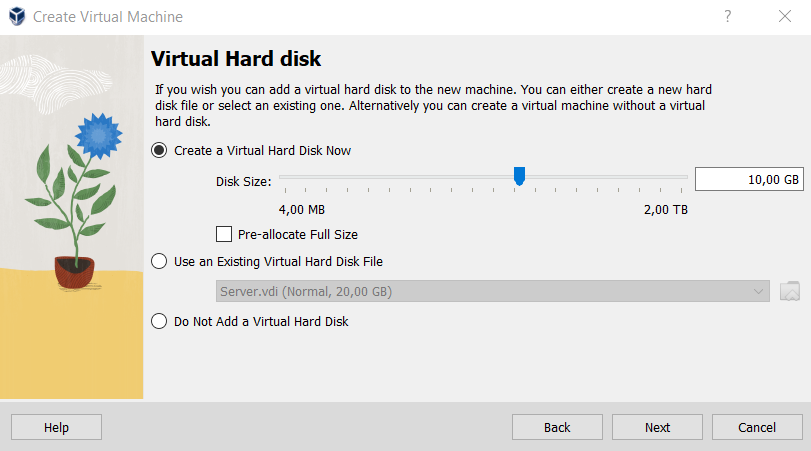

Finally, we receive a summary of everything that was entered before. Make sure all fields are OK before pressing "Finish".
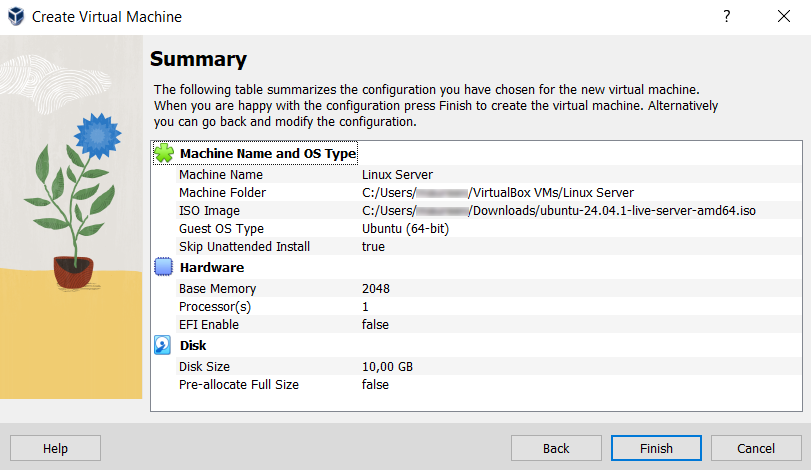

## Installing Ubuntu Server on the Virtual Machine

We can now start our Virtual Machine. This will launch the installation process. Wait until you end up on the Welcome Screen.

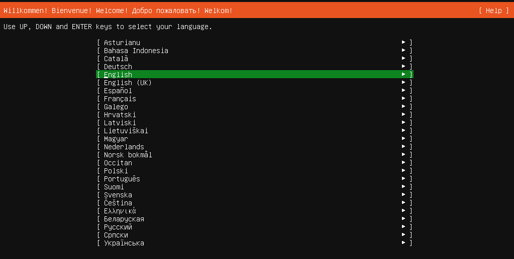

You may see a question about updating the installer. You're free to choose to update or continue without updating, it doesn't have any impact on your server.

Next is keyboard configuration. This is important or you won't be able to type properly. You can use the keyboard identifier or input it yourself.
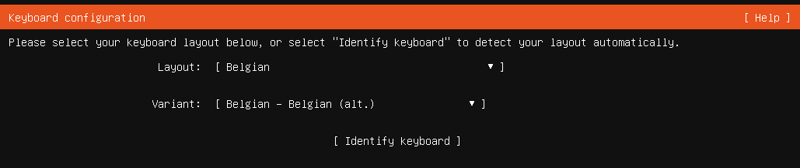

Now we get to choose the type of installation. "Ubuntu Server" is the default and the one we will be using.
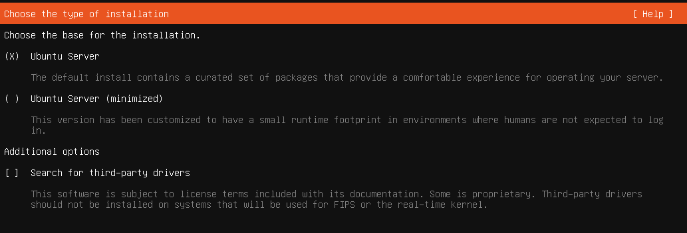

For the network configuration part, you can leave the pre-filled information, it should be correct.
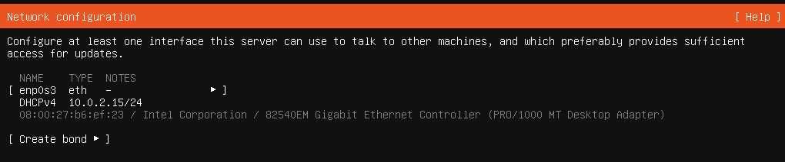

If you require a proxy to connect to the internet, fill it in the next window. If you don't, leave it blank and click "Done".
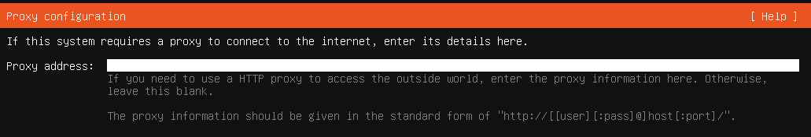

In case you wish to use an alternative mirror for Ubuntu, you can enter the details. Otherwise accept the default mirror.
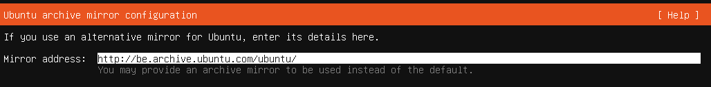

Next we have the guided storage configuration. We recommend using an entire disk and setting up this disk as an LVM group. LUKS encryption is not mandatory but you can add it if you wish to.
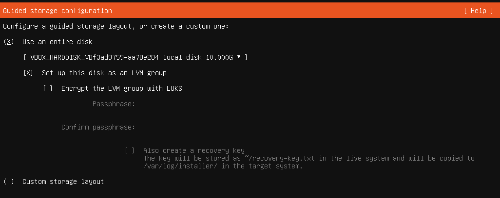

You will then see a summary of the file system.
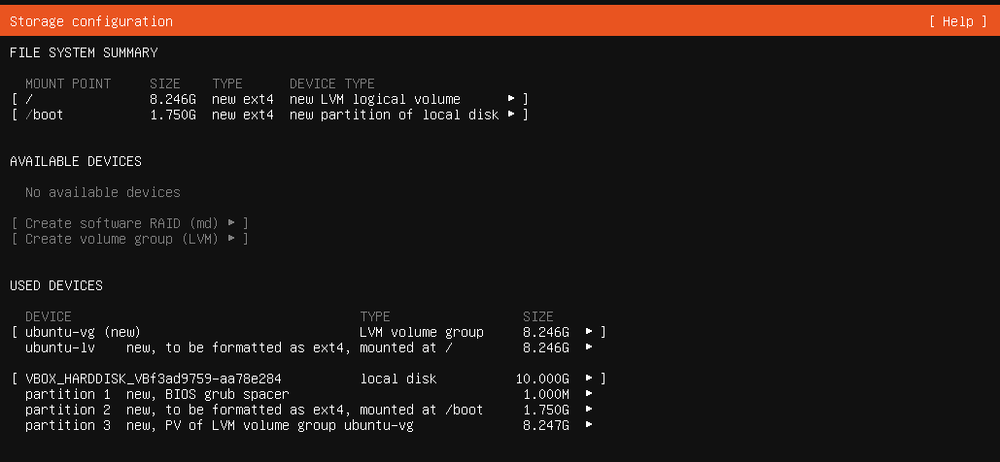

When you click "Done" a window will pop up asking you to confirm. This is normal and you should press "Continue".
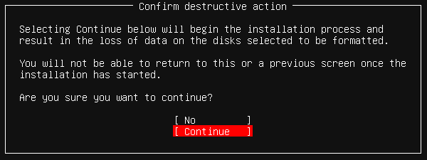

Then we enter the profile configuration. Enter your information in the according boxes.
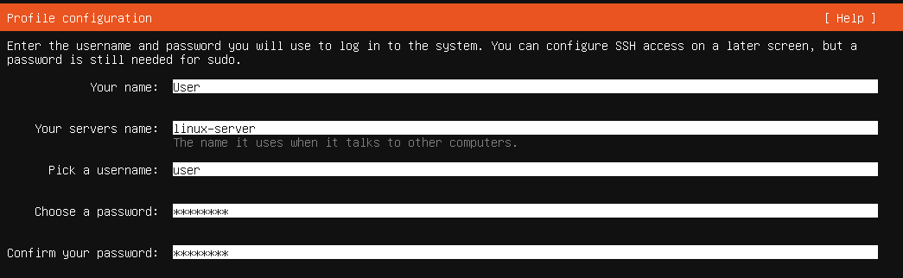

You will be asked about upgrading to Ubuntu Pro. We will choose to skip for now.
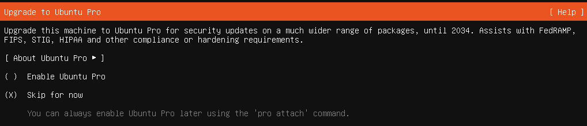

Next question is about SSH configuration. We want to use SSH but will install and configure it manually later. Read more about that in the [SSH installation & configuration Manual](/Manuals/SSH.md).
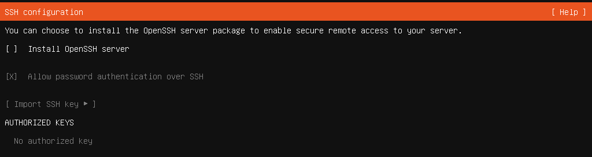

Then we have featured server snaps. We won't install any of them so just click "Done".

It now continues the installation process. Let it run until you can click on the "Reboot Now" button.

You will see a message asking you to remove the installation medium. You can do this by clicking in your VirtualBox on Devices > Optical Drives > Remove disk from virtual drive. Then press the enter key.

And this will bring us to the login screen where you can enter your credentials. You now have a working Linux server !