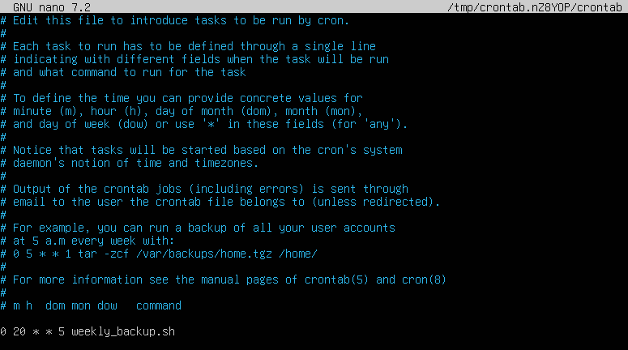

# cron Configuration Manual

We will be using cron to run weekly backups on our system. This utility is already pre-installed on Ubuntu servers.

This script will run every Friday at 20:00.

## Creating the backup script

Create a new file in "/usr/local/bin" with this script in it.

```sh
#!/bin/bash

# Define backup directory
BACKUP_DIR="/var/backups"
TIMESTAMP=$(date +'%Y-%m-%d')
BACKUP_PATH="$BACKUP_DIR/backup_$TIMESTAMP"

# Define the backup archive filename
BACKUP_ARCHIVE="$BACKUP_PATH.tar.gz"

# Define directories and files to back up
DHCP_CONFIG="/etc/dhcp/dhcpd.conf"
DNS_CONFIG_DIR="/etc/bind"
DNS_NAMED_CONFIG="/etc/bind/named.conf"
DNS_LOCAL_CONFIG="/etc/bind/named.conf.local"
DNS_OPTIONS_CONFIG="/etc/bind/named.conf.options"
DNS_FORWARD_CONFIG="/etc/bind/forward.library.local.db"
DNS_REVERSE_CONFIG="/etc/bind/reverse.library.local.db"
NGINX_CONFIG_DIR="/etc/nginx"
NGINX_SITES_AVAILABLE="/etc/nginx/sites-available"
NGINX_SITES_ENABLED="/etc/nginx/sites-enabled"

# Check if backup directory exists; if not, create it
if [ ! -d "$BACKUP_DIR" ]; then
    echo "Backup directory does not exist. Creating it..."
    mkdir -p "$BACKUP_DIR"
fi

# Create a timestamped backup directory (temporarily used for organizing files)
mkdir -p "$BACKUP_PATH"

# Backup DHCP config
if [ -f "$DHCP_CONFIG" ]; then
    echo "Backing up DHCP configuration..."
    cp "$DHCP_CONFIG" "$BACKUP_PATH/dhcpd.conf"
else
    echo "DHCP configuration file not found!"
fi

# Backup DNS config (for BIND)
if [ -d "$DNS_CONFIG_DIR" ]; then
    echo "Backing up DNS configuration..."

    # Back up multiple files
    if [ -f "$DNS_NAMED_CONFIG" ]; then
        cp "$DNS_NAMED_CONFIG" "$BACKUP_PATH/named.conf"
    fi
    if [ -f "$DNS_LOCAL_CONFIG" ]; then
        cp "$DNS_LOCAL_CONFIG" "$BACKUP_PATH/named.conf.local"
    fi
    if [ -f "$DNS_OPTIONS_CONFIG" ]; then
        cp "$DNS_OPTIONS_CONFIG" "$BACKUP_PATH/named.conf.options"
    fi
    if [ -f "$DNS_FORWARD_CONFIG" ]; then
        cp "$DNS_FORWARD_CONFIG" "$BACKUP_PATH/forward.library.local.db"
    fi
    if [ -f "$DNS_REVERSE_CONFIG" ]; then
        cp "$DNS_REVERSE_CONFIG" "$BACKUP_PATH/reverse.library.local.db"
    fi
else
    echo "DNS configuration file not found!"
fi

# Backup Nginx config
if [ -d "$NGINX_CONFIG_DIR" ]; then
    echo "Backing up Nginx configuration..."
    # Copy the entire /etc/nginx directory
    cp -r "$NGINX_CONFIG_DIR" "$BACKUP_PATH/nginx"
    
    # Back up individual sites
    if [ -d "$NGINX_SITES_AVAILABLE" ]; then
        cp -r "$NGINX_SITES_AVAILABLE" "$BACKUP_PATH/nginx/sites-available"
    fi
    if [ -d "$NGINX_SITES_ENABLED" ]; then
        cp -r "$NGINX_SITES_ENABLED" "$BACKUP_PATH/nginx/sites-enabled"
    fi
else
    echo "Nginx configuration directory not found!"
fi

# Create a compressed tarball (gzip) of the backup directory
echo "Compressing backup into a single archive..."
tar -czf "$BACKUP_ARCHIVE" -C "$BACKUP_DIR" "backup_$TIMESTAMP"

# Print success message
echo "Backup completed successfully. Archive stored at $BACKUP_ARCHIVE."

# Clean up the temporary backup directory after creating the archive
rm -rf "$BACKUP_PATH"
```

Make the script executable by changing the permissions. `chmod +x /usr/local/bin/weekly_backup.sh`

## Configuring cron on the Server

Now we need to add this script to our cron jobs. Type `crontab -e` and add this line at the bottom of the file.



You can view your active cron jobs with a simple command. `crontab -l`
