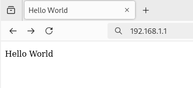

# nginx Installation & Configuration Manual

The client wants a Web Server that hosts a local page.

## Installation nginx on the Server

To install, run this command: `sudo apt install nginx`

If you want to check, open a browser and go to "localhost" and you should see the default welcome page from nginx show up.

## Configuring nginx on the Server

The default page is placed in the "/var/www/html/" directory. We will be placing our static pages there as well. Edit the "index.html" file that you see there and change it to your own fittings, then save the file.

Restart nginx with `sudo service nginx restart`

## Testing nginx on the Client

Open a browser and check "localhost" again, it should show your own welcome page.

Your web server is configured !