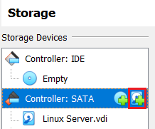
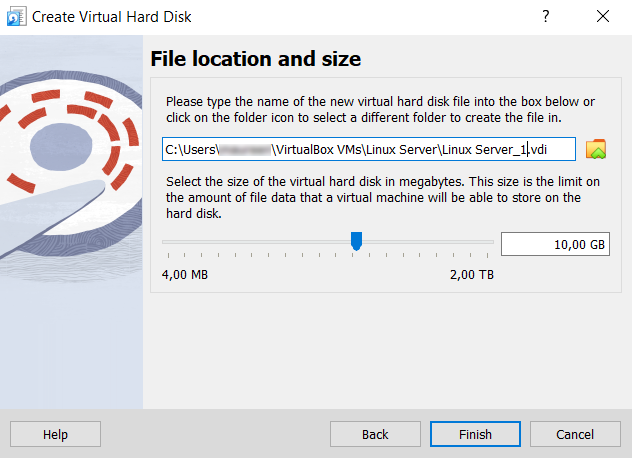
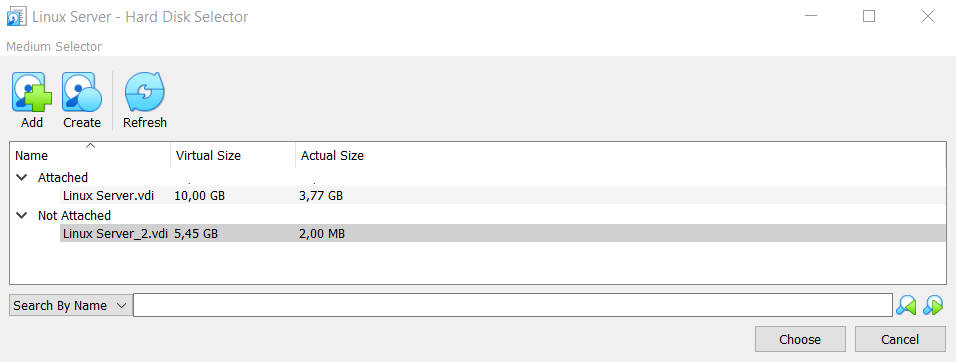
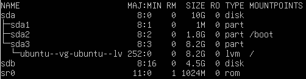
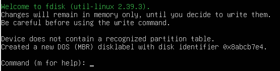
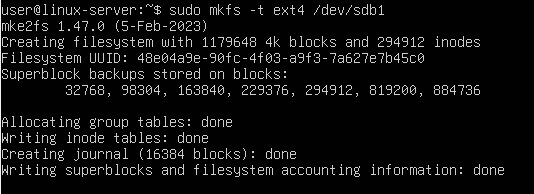

# rsync Installation & Configuration Manual

Backups are placed on a partition located on separate disk, this partition must be mounted for the backup, then unmounted.

## Creating new disk on the Server

First you have to create the disk in VirtualBox. Open the settings of your VM and click "Storage". There, select "Controller: SATA" and click "Add hard disk".

Next, click on the "Create disk image file" button.

A new window pops up, asking about the Virtual Disk hard drive type. Pick "VDI" from the options.
Then click "Next" and "Next" again.
You can now choose the location and size of your hard drive. Then "Finish".

You will now see your new hard drive listed under "Not Attached". Select it and press "Choose".

Close the settings and then start your VM.Check the disks on the server with `lsblk`

As you can see, there's a new disk called "sdb" that was added.

## Partitioning & Mounting the new disk

Now we have to partition this disk. `sudo fdisk /dev/sdb`

You will see a welcome screen and a place to type commands.

First we have to choose the partition scheme. We will be using UEFI, so type "g" and hit Enter.

It will tell you it created a new GPT disklabel. Now type "n" to create a new partition. You will have to answer some questions about partition number, first sector and last sector. The default is ok for all of them.

When you're done type "p" to list the new partition table. If you are satisfied, type "w" to write the partition table and save your changes.

Now that the drive has a partition table, you can format it. We will use the popular ext4 format. `sudo mkfs -t ext4 /dev/sdb1`

To use this new drive, we must mount the partition on it to a mount point in the filesystem. `sudo mount /dev/sdb1 /mnt`

If all goes well, you will see no error message.

## Installing rsync on the Server

Rsync is typically included in many Linux distributions. To check whether it's already installed on your system, run: `rsync --version`

On our Ubuntu Server, it was already pre-installed.

## Using rsync

To synchronize folders, use this command: `rsync -av var/backups/backup_$(date +\%Y-\%m-\%d).tar.gz mnt/`

We can now see our files have been copied in mnt.